# Analizador-52084  Tema: 39568_2-

A contiuacion, se proporciona una gramatica en notacion EBNF, que describe un lenguaje especifico.

<programa>      ::= { <instrucción> }+

<instrucción>   ::= <decisión>

<decisión>      ::= 'si' <condición> 'entonces' '{' { <sentencia> } '}' 
                    [ 'sino' '{' { <sentencia> } '}' ]

<sentencia>     ::= { <salida> }+ <terminar>

<salida>        ::= 'imprimir' '(' <cadena> ')' ';'

<terminar>      ::= 'salir' ';'

<condición>     ::= 'verdadero' | 'falso'

<cadena>        ::= '"' { <carácter> } '"'

<carácter>      ::= <letra> | <dígito> | <símbolo>

<letra>         ::= 'a' | 'b' | ... | 'z' | 'A' | 'B' | ... | 'Z'

<dígito>        ::= '0' | '1' | ... | '9'

<símbolo>       ::= ' ' | ',' | '.' | '?' | '!' | ':' | ';'

Con esta gramatica EBNF realizamos otra pero en ANTLR4 mediante visual cod; de forma tal que es de la siguiente manera: 

grammar analizador;

// Parser rules

programa 
    : instruccion+ 
    ;

instruccion
    : decision 
    ;

decision
    : SI condicion ENTONCES sentencia* (SINO LBRACE sentencia RBRACE)? 
    ; 

sentencia 
    : salida+ terminar 
    ;

salida
    : IMPRIMIR LPAREN CADENA RPAREN SEMI ;

terminar
    : SALIR SEMI ;
condicion
    : VERDADERO
    | FALSO ;

// Lexer rules

CADENA
    : '"' (~["\r\n])* '"' ;

fragment CARACTER
    : LETRA
    | DIGITO
    | SIMBOLO ;

fragment LETRA
    : [a-zA-Z_] ;

fragment DIGITO
    : [0-9] ;

fragment SIMBOLO
    : ':' | '!' | '?' | '|' | ';' ;

// Ignorar espacios en blanco

WS : [ \t\r\n]+ -> skip ;

//tokens 

SI         : 'si' ;

ENTONCES   : 'entonces' ;

SINO       : 'sino' ;

VERDADERO  : 'verdadero' ;

FALSO      : 'falso' ;

IMPRIMIR   : 'imprimir' ;

SALIR      : 'salir' ;

LPAREN     : '(' ;

RPAREN     : ')' ;

SEMI       : ';' ;

LBRACE: '{' ;

RBRACE: '}';

// ID al final para no interferir

ID : [a-zA-Z]+ ;

Esta gramatica esta compuesta por parser rules como;

Programa , el cual consiste en una o mas instrucciones y es el punto de entrada de la gramatica, tambien esta instruccion que es una estructura de decision, esta representa una decision condicional: 

-Si condicion entonces sentencia

-Opcional sino otra sentencia

La sentencia es una o mas salidas el cual se imprime el texto y luego se termina (salir), ademas tiene una condicion que evalua del si (condicion) o solo  acepta verdadero o falso.

Tambien esta gramatica contiene lexer rulers la cuales son:

-CADENA:  '"' (~["\r\n])* '"' ; (es una cadena de texto entre comillas sin saltos de linea)

-Fragmentos: Letra (letras A-Z y _) , Digito (numeros 0-9) y simbolos (signos permitidos en cadenas).

-WS : [ \t\r\n]+ -> skip ; (ignora los espacios, tabs y saltos de linea).

-Tokens: 
 
SI         : 'si' ;

ENTONCES   : 'entonces' ;

SINO       : 'sino' ;

VERDADERO  : 'verdadero' ;

FALSO      : 'falso' ;

IMPRIMIR   : 'imprimir' ;

SALIR      : 'salir' ;

LPAREN     : '(' ;

RPAREN     : ')' ;

SEMI       : ';' ;

LBRACE     : '{' ;

RBRACE     : '}' ;

Estos son tokens que representan las palabras claves de lenguajes y simbolos que se usan

-ID : [a-zA-Z]+ ; estos tokens son para ifentifcar nombres.

En base a la gramatica en ANTLR realizamos  cuatro archivosde texto, con ejemplos para el reconocimiento correcto e incorrecto de la gramatica dada.Estos ejemplos son:

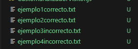

El “ejemplo1correcto.txt”: 

si verdadero entonces
  imprimir("Hola!");
  imprimir("Todo bien?");
  salir;
sino {
  imprimir("Adiós!");
                                                              salir;
}

Este ejemplo es correcto debido a que cumple con lo siguiente:

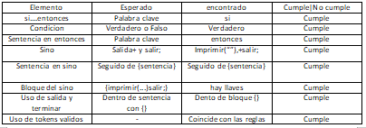

Arbol correspondiente:

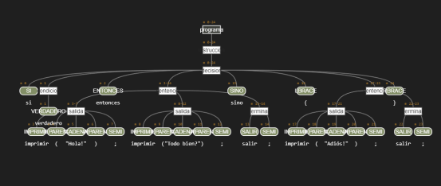

El “ejemplo2correcto.txt”:

si verdadero entonces
 imprimir("buenos dias!") ;
 imprimir("¿como esta?") ;
salir;
                                                                     sino 
                                                                       imprimir("Hasta luego!");
                                                                       salir;

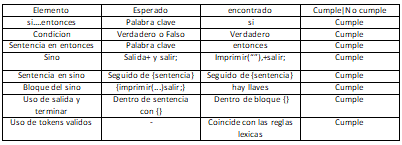

Arbol correspondiente:

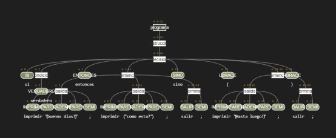

El “ejemplo3incorrecto.txt”:

si verdadero entonces
 imprimir("");
 salir;
sino 
                                                          imprimir("");
 salir;

 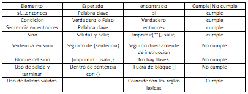

 Arbol correspondiente:

 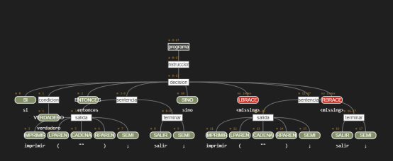

 El “ejemplo4incorrecto.txt”:

si verdadero entonces
 salir;
sino 
 salir;

 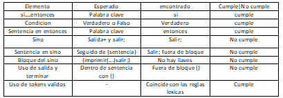

 Arbol correspondiente:

 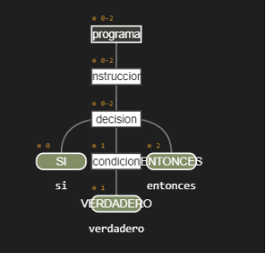

 Ademas realizamos la tabla de tokens en el archivo de inde.js para cada ejemplo, realizando la siguiente gramatica:

 ndex.js:

 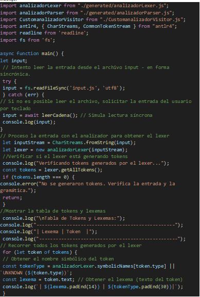
 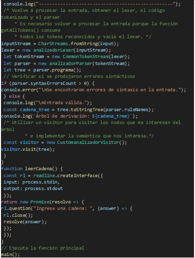

 Tambien realizamos otro archivo para que la gramatica se ejecute y compile de manera correcta generando de forma adecuada los arboles correspondiente de cada ejemplo:

CustomanalizadorVisitor.js:

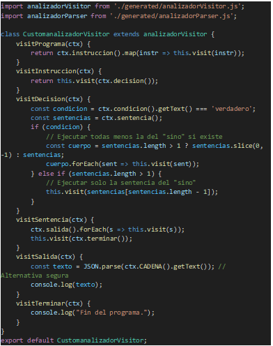

